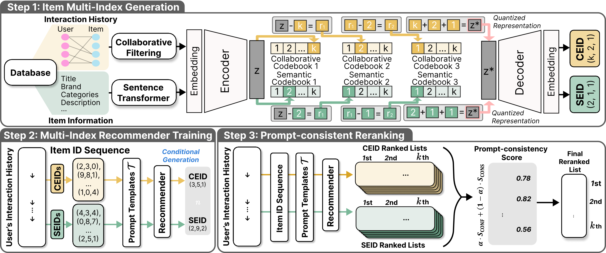

# MVIGER

Official PyTorch implementation of **MVIGER: Multi-View Variational Integration of Complementary Knowledge for Generative Recommender**, accepted as a full paper at **SIGIR 2026**.

📄 **Paper:** https://dl.acm.org/doi/10.1145/3805712.3809591

## Overview

MVIGER addresses the inconsistency of generative recommenders across different prompt templates and item index types by integrating their complementary preference knowledge.

Our framework consists of three main components:

1. **Item Multi-Index Generation:** Generate collaborative and semantic item indices from user-item interactions and item information.
2. **Multi-Index Recommender Training:** Train the generative recommender with heterogeneous item indices and diverse prompt templates.
3. **Prompt-consistent Reranking:** Integrate predictions from different template-index combinations using prompt-consistency scores.

<p align="center">
  
</p>
## Requirements

```text
torch
transformers==4.26.0
sentence-transformers
numpy
pandas
scipy
tensorboardX
scikit-learn
tqdm
```

## Dataset

We use three datasets in our paper. Preprocessed data are provided for reproducibility.

## Quick Start

### 1. Embedding Generation

MVIGER uses collaborative and semantic embeddings to construct heterogeneous item indices.

#### Collaborative Embedding

We use **LightGCN** to generate collaborative embeddings.

```bash
cd ./model/modules/lightgcn/

python main.py \
    --decay=1e-4 \
    --lr=0.001 \
    --layer=3 \
    --seed=1 \
    --dataset=$DATASET \
    --topks="[10]" \
    --recdim=768 \
    --load=0
```

Replace `$DATASET` with the target dataset name.

#### Semantic Embedding

We use **Sentence-T5** to generate semantic embeddings from item information.

Modify `config_embedding.json` for the target dataset, then run:

```bash
python semantic_embedding.py -c config_embedding.json
```

### 2. Index Generation

Configure the target dataset and `index_type` in `config_rqvae.json`, then generate item indices:

```bash
python train.py -c config_rqvae.json
```

### 3. Model Training

MVIGER training consists of two stages.

#### Stage 1: Recommender Pretraining

Configure the dataset and index file in `config_mviger_pre.json`, then run:

```bash
python train.py -c config_mviger_pre.json
```

#### Stage 2: MVIGER Prior Network Training

Configure the dataset, pretrained recommender checkpoint, and index file in `config_mviger_post.json`, then run:

```bash
python train.py -c config_mviger_post.json
```

### 4. Model Inference and Evaluation

Configure the checkpoint path and index file in `config_test.json`.

Generate and save predictions on the test set:

```bash
python test.py -c config_test.json
```

Then evaluate the generated results:

```bash
python scoring.py
```

## Citation

If you find this repository useful, please cite our paper:

```bibtex
@inproceedings{10.1145/3805712.3809591,
author = {Kim, Tongyoung and Yoon, SooJin and Kang, SeongKu and Yeo, Jinyoung and Lee, Dongha},
title = {MVIGER: Multi-View Variational Integration of Complementary Knowledge for Generative Recommender},
year = {2026},
isbn = {9798400725999},
publisher = {Association for Computing Machinery},
address = {New York, NY, USA},
url = {https://doi.org/10.1145/3805712.3809591},
doi = {10.1145/3805712.3809591},
abstract = {Language Models (LMs) have been widely used in recommender systems to incorporate textual information of items into item IDs, leveraging their advanced language understanding and generation capabilities. Recently, generative recommender systems have utilized the reasoning abilities of LMs to directly generate index tokens for potential items of interest based on the user's interaction history. To inject diverse item knowledge into LMs, prompt templates with detailed task descriptions and various indexing techniques derived from diverse item information have been explored. This paper focuses on the inconsistency in outputs generated by variations in input prompt templates and item index types, even with the same user's interaction history. Our in-depth quantitative analysis reveals that preference knowledge learned from diverse prompt templates and heterogeneous indices differs significantly, indicating a high potential for complementarity. To fully exploit this complementarity and provide consistent performance under varying prompts and item indices, we propose MVIGER, a unified variational framework that models selection among these information sources as a categorical latent variable with a learnable prior. During inference, this prior enables the model to adaptively select the most relevant source or aggregate predictions across multiple sources, thereby ensuring high-quality recommendation across diverse template-index combinations. We validate the effectiveness of MVIGER on three real-world datasets, demonstrating its superior performance over existing generative recommender baselines through the effective integration of complementary knowledge.},
booktitle = {Proceedings of the 49th International ACM SIGIR Conference on Research and Development in Information Retrieval},
pages = {834–844},
numpages = {11},
keywords = {sequential recommendation, generative retrieval, variational integration, personalization},
location = {Australia},
series = {SIGIR '26}
}
```
